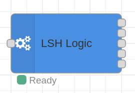

# Node-RED Contrib LSH Logic

[](https://badge.fury.io/js/node-red-contrib-lsh-logic)
[](https://github.com/labodj/node-red-contrib-lsh-logic/actions/workflows/ci.yml)
[](./LICENSE)

A powerful, high-performance Node-RED node designed to manage advanced automation logic for embedded smart home devices (ESP32/ESP8266 based). Built with TypeScript for maximum reliability and type safety.

This node replaces complex Node-RED flows with a single, robust, and stateful component that manages device state, implements distributed click logic (two-phase commit), and actively monitors device health.



---

## Key Features

- **Protocol v2.0 Support**: Implements the efficient LSH Protocol v2.0, utilizing numeric IDs and optimized payloads (JSON or MsgPack) to minimize network overhead.
- **Robust Health Monitoring**: Features a multi-stage intelligent Watchdog that detects stale or offline devices without generating false positives during startup or temporary network glitches.
- **Distributed Click Logic**: Implements a Two-Phase Commit protocol for critical actions (like "Long Clicks"), ensuring commands are executed only when all target devices are ready and online.
- **Homie & HA Discovery**: Fully compliant with the [Homie Convention](https://homieiot.github.io/) for state tracking and automatically generates Home Assistant Auto-Discovery payloads for seamless integration.
- **High Performance**: Optimized message routing using direct string parsing and efficient internal state management.
- **Declarative Configuration**: Define your entire system in a single `system-config.json` file. The node automatically hot-reloads configuration changes.

## Installation

Install directly from the Node-RED **Palette Manager** or via npm in your user directory (e.g., `~/.node-red`):

```bash
npm install node-red-contrib-lsh-logic
```

## How It Works

This node acts as the central orchestrator for your custom smart home devices. It subscribes to MQTT topics, processes incoming telemetry and events, updates its internal state registry, and dispatches commands.

### Inputs

The node's "Configuration" output connects to an `mqtt-in` node to dynamically manage subscriptions. It processes:

1.  **LSH Protocol Topics**:
    *   `<lshBase>/<device>/conf`: Static configuration (actuators `a`, buttons `b`).
    *   `<lshBase>/<device>/state`: Live actuator states (`s`).
    *   `<lshBase>/<device>/misc`: Events like Clicks, Boot notifications, Pings.
2.  **Homie Topics**:
    *   `<homieBase>/<device>/$state`: Connectivity status (`ready`, `lost`).
    *   Homie attributes (`$mac`, `$fw/version`, etc.) for HA Discovery.

### Outputs

The node has five distinct outputs for clear and organized flows:

1.  **LSH Commands**: Commands targeting your ESP devices (e.g., `SET_STATE`, `PING`, `CLICK_ACK`).
2.  **Other Actor Commands**: Abstracted commands for controlling 3rd party devices (Tasmota, Zigbee) via other Node-RED flows. The payload contains the listing of target actors and the state to set.
3.  **Alerts**: Human-readable health alerts (Markdown formatted) suitable for notifications (Telegram/Slack).
4.  **Configuration**: Dynamic control messages for the `mqtt-in` node.
5.  **Debug**: Passthrough of original messages for debugging.

## Configuration

### Node Settings

*   **MQTT Paths**: Base topics for Homie and LSH protocols.
*   **System Config Path**: Location of your `system-config.json` (absolute or relative to Node-RED user dir).
*   **Protocol**: Choose between `JSON` (human readable) and `MsgPack` (binary, efficient).
*   **Timings**: Customize Watchdog intervals, Ping timeouts, and Click expiration times.
*   **Home Assistant**: Enable/Disable auto-discovery generation.

### `system-config.json`

This file defines the topology of your smart home. It should be placed in your Node-RED user directory.

```json
{
  "devices": [
    {
      "name": "living-room-switch",
      "longClickButtons": [
        {
          "id": 1, 
          "actors": [
            { "name": "living-room-light", "allActuators": true }
          ],
          "otherActors": ["tasmota_shelf_lamp"]
        }
      ]
    },
    { "name": "living-room-light" },
    { "name": "kitchen-light" }
  ]
}
```

*   **`name`**: Must match the device ID used in MQTT topics.
*   **`id`**: Button ID (numeric, e.g., `1` for Button 1).
*   **`actors`**: Target LSH devices.
*   **`otherActors`**: Target external devices (strings).

## Best Practices

### Dynamic MQTT Subscriptions

The most powerful way to use this node is to let it manage your MQTT subscriptions automatically. This creates a "zero-maintenance" flow that adapts to your configuration.

**Connect the 4th output ("Configuration") directly to an `mqtt-in` node.**


When you deploy or when `system-config.json` changes, the `lsh-logic` node will:

1. Send a message to the `mqtt-in` node to **unsubscribe from all topics**.
2. Send a second message to **subscribe to the new, correct list of topics**.

This ensures your `mqtt-in` node is always listening to exactly the right topics without any manual changes.

## Advanced: MsgPack Support

To use MsgPack:
1.  Set **LSH Protocol** to `MsgPack` in the node settings.
2.  Configure your **Input MQTT Node** to return **"a Buffer"** instead of a parsed string.
3.  Ensure your ESP firmware supports decoding MsgPack payloads.

The node handles decoding (Input) and encoding (Output) transparently.

## Contributing

Contributions are welcome!

### Development Setup

1.  Clone the repo: `git clone https://github.com/labodj/node-red-contrib-lsh-logic.git`
2.  Install dependencies: `npm install`
3.  Build: `npm run build`
4.  Test: `npm test`

## License

Apache 2.0 - See [LICENSE](./LICENSE) for details.
