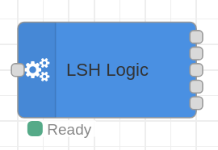
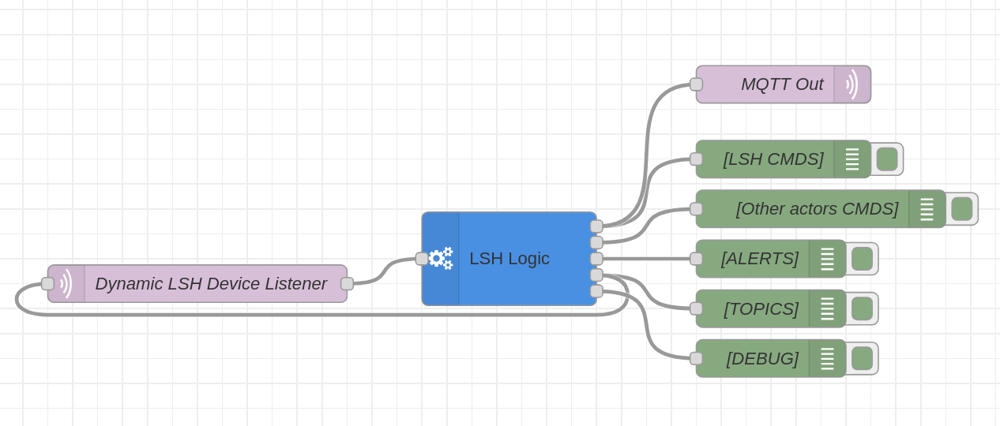

# Node-RED Contrib LSH Logic

[](https://badge.fury.io/js/node-red-contrib-lsh-logic)
[](https://github.com/labodj/node-red-contrib-lsh-logic/actions/workflows/ci.yaml)
[](./LICENSE)

A powerful, high-performance Node-RED node designed to manage advanced automation logic for smart home devices that speak the public LSH MQTT / protocol contract. Built with TypeScript for maximum reliability and type safety.

This node replaces complex Node-RED flows with a single, robust, and stateful component that manages device state, implements distributed click logic (two-phase commit), and actively monitors device health.

The original installation behind it uses Controllino controllers plus ESP32 bridges, but the Node-RED boundary is the **LSH protocol contract**, not the exact hardware. If another controller / bridge stack implements the same public MQTT topics and payload contract, this node is designed to work there too.



---

## Key Features

- **Shared LSH Protocol Support**: Uses the generated contract vendored from `lsh-protocol`, keeping command IDs, compact keys and examples aligned with the firmware repositories.
- **Robust Health Monitoring**: Features a multi-stage intelligent Watchdog that detects stale or offline devices without generating false positives during startup or temporary network glitches.
- **Robust Cold Recovery**: If Node-RED restarts, the node first reuses retained `conf`/`state` snapshots when they are already complete. Only when at least one configured device is missing an authoritative snapshot does it request a single bridge-local `BOOT` replay, then repairs missing snapshots and pings any device that is still unreachable.
- **Distributed Click Logic**: Implements a Two-Phase Commit protocol for critical actions (like "Long Clicks"), ensuring commands are executed only when target devices are reachable and currently healthy. Pending clicks expire on a hard timeout; a late confirmation is rejected even if a later cleanup sweep has not run yet.
- **Homie & HA Discovery**: Fully compliant with the [Homie Convention](https://homieiot.github.io/) for state tracking and automatically generates Home Assistant Auto-Discovery payloads for seamless integration.
- **Config-Driven HA Entity Mapping**: Optionally remap Homie actuator nodes to Home Assistant `light`, `switch`, or `fan` entities and assign friendly names directly from `system-config.json`.
- **High Performance**: Optimized message routing using direct string parsing and efficient internal state management.
- **Declarative Configuration**: Define your entire system in a single `system-config.json` file. The node automatically hot-reloads configuration changes.

## Installation

Install directly from the Node-RED **Palette Manager** or via npm in your user directory (e.g., `~/.node-red`):

```bash
npm install node-red-contrib-lsh-logic
```

## Scope And Portability

This package is intentionally **LSH-oriented**. It is not meant as a completely generic drop-in automation node for arbitrary MQTT devices.

The important dependency is the public **LSH protocol + MQTT contract**, not the exact hardware used in the original installation.

In practice that means:

- if your devices speak the same LSH topics and payload contract, this node is intended to work with them
- if your devices use a different protocol model entirely, this package is the wrong abstraction layer
- the original Controllino + ESP32 combination is the reference implementation, not a hard runtime requirement

## How It Works

This node acts as the central orchestrator for your protocol-compatible smart home devices. It subscribes to MQTT topics, processes incoming telemetry and events, updates its internal state registry, and dispatches commands.

The canonical command IDs, compact wire keys and golden JSON examples are generated from the shared spec in [vendor/lsh-protocol/shared/lsh_protocol.md](vendor/lsh-protocol/shared/lsh_protocol.md). The LSH payload layer assumes a trusted environment and a cooperative broker.

At startup the node uses retained LSH snapshots when available, but it does not trust retained Homie `$state` alone as proof of current reachability: that must come from a live Homie transition or live LSH traffic. After a short subscription-settle window, the node checks whether every configured device already has an authoritative `conf + state` snapshot. If yes, it skips the startup `BOOT` entirely. If not, it requests a single bridge-local `BOOT` replay, waits for the replay window, and then runs an active verification pass. During that verification, reachable devices receive only the missing snapshot requests, while still-unreachable devices are pinged directly. A later live `ready`, `conf`, `state`, `misc`, or `PING` response automatically recovers devices that were offline during startup. During this warm-up window the periodic watchdog is intentionally paused; startup reachability is decided by the dedicated verification cycle, not by watchdog alerts racing the initial sync.

The shared maintenance workflow lives in [vendor/lsh-protocol/README.md](vendor/lsh-protocol/README.md). This README intentionally focuses on Node-RED behavior instead of restating protocol ownership rules.

Operational simplifications:

- If a runtime config reload becomes unreadable or invalid, the node intentionally fails closed: it clears the active config, unsubscribes, and waits for a valid file again.
- Reloading `system-config.json` always clears pending network click transactions. In-flight distributed clicks are intentionally failed rather than preserved across a config change.
- Runtime config reloads do not restart the startup warm-up/verification cycle. Recovery after reload is best-effort through normal live traffic, retained MQTT data and later watchdog pings.
- Distributed long-click logic requires an authoritative actuator snapshot for every targeted LSH device. If a target is reachable but still missing fresh state, the click fails fast and is retried naturally on the next user action.
- Retained `conf` and `state` snapshots are treated as the last known authoritative topology/state, not as proof that the device is currently alive. Device health and reachability come only from live Homie transitions, live LSH traffic and watchdog ping responses.
- Extremely narrow timing races during startup or config reload are handled in best-effort mode rather than with complex transaction recovery logic.

To verify that the Node-RED generated protocol files match the vendored source of truth:

```bash
python3 tools/update_lsh_protocol.py --check
```

### Inputs

The node accepts messages from an `mqtt-in` node. It processes:

1.  **LSH Protocol Topics**:
    - `<lshBase>/<device>/conf`: Static configuration (actuators `a`, buttons `b`).
    - `<lshBase>/<device>/state`: Live actuator states (`s`).
    - `<lshBase>/<device>/misc`: Events like Clicks and Pings.
2.  **Homie Topics**:
    - `<homieBase>/<device>/$state`: Connectivity status (`ready`, `lost`).
    - Homie attributes (`$mac`, `$fw/version`, etc.) for HA Discovery.

### Outputs

The node has five distinct outputs for clear and organized flows:

1.  **LSH Commands**: Commands targeting your LSH protocol devices (e.g., `SET_STATE`, `PING`, `CLICK_ACK`).
2.  **Other Actor Commands**: Abstracted commands for controlling 3rd party devices (Tasmota, Zigbee) via other Node-RED flows. The payload contains the listing of target actors and the state to set.
3.  **Alerts**: Human-readable health alerts (Markdown formatted) suitable for notifications (Telegram/Slack).
4.  **Configuration**: Dynamic control messages for the `mqtt-in` node.
5.  **Debug**: Passthrough of original messages for debugging.

## Configuration

### Node Settings

- **MQTT Paths**: Base topics for Homie and LSH protocols. Both must end with `/`.
- **System Config Path**: Location of your `system-config.json` (absolute or relative to Node-RED user dir).
- **Protocol**: Choose between `JSON` (human readable) and `MsgPack` (binary, efficient).
- **Timings**: Customize Watchdog intervals, Ping timeouts, the hard pending-click timeout, periodic click cleanup, and the optional startup replay window.
- **Home Assistant**: Enable/Disable auto-discovery generation.

### `system-config.json`

This file defines the topology of your smart home. It should be placed in your Node-RED user directory.

Ready-to-copy examples are available in:

- [examples/system-config.minimal.json](examples/system-config.minimal.json)
- [examples/system-config.discovery-overrides.json](examples/system-config.discovery-overrides.json)
- [examples/system-config.multi-device.json](examples/system-config.multi-device.json)

```json
{
  "devices": [
    {
      "name": "c1",
      "haDiscovery": {
        "deviceName": "Kitchen Board",
        "defaultPlatform": "switch",
        "nodes": {
          "1": {
            "platform": "light",
            "name": "Kitchen Ceiling",
            "defaultEntityId": "light.kitchen_ceiling"
          }
        }
      },
      "longClickButtons": [
        {
          "id": 1,
          "actors": [{ "name": "j1", "allActuators": true }],
          "otherActors": ["tasmota_shelf_lamp"]
        }
      ]
    },
    { "name": "j1" },
    { "name": "k1" }
  ]
}
```

- **`name`**: Must match the exact device ID used in MQTT topics. With the current reference bridge defaults this is typically a short ID such as `c1`, `j1`, `k1`; the default bridge build allocates 4 characters unless `CONFIG_MAX_NAME_LENGTH` is raised.
- **`haDiscovery`**: Optional Home Assistant discovery overrides for this device.
- **`haDiscovery.deviceName`**: Optional Home Assistant device name override.
- **`haDiscovery.defaultPlatform`**: Optional default Home Assistant entity platform for all actuator nodes of the device (`light`, `switch`, or `fan`).
- **`haDiscovery.nodes`**: Optional per-node overrides keyed by the Homie node ID as published under `$nodes`.
- **`haDiscovery.nodes.<id>.platform`**: Optional per-node Home Assistant entity platform override.
- **`haDiscovery.nodes.<id>.name`**: Optional friendly entity name override shown in Home Assistant.
- **`haDiscovery.nodes.<id>.defaultEntityId`**: Optional Home Assistant `default_entity_id` override for first discovery.
- **`haDiscovery.nodes.<id>.icon`**: Optional Home Assistant icon override.
- **`id`**: Button ID (numeric, e.g., `1` for Button 1).
- **`actors`**: Target LSH devices.
- **`otherActors`**: Target external devices (strings).

## Best Practices

### Dynamic MQTT Subscriptions

The most powerful way to use this node is to let it manage your MQTT subscriptions automatically. This creates a "zero-maintenance" flow that adapts to your configuration.

**Connect the 4th output ("Configuration") directly to an `mqtt-in` node.**



When you deploy or when `system-config.json` changes, the `lsh-logic` node will:

1. Send a message to the `mqtt-in` node to **unsubscribe from all topics**.
2. Send a second message to **subscribe to the new, correct list of topics**.

This ensures your `mqtt-in` node is always listening to exactly the right topics without any manual changes.

## Advanced: MsgPack Support

To use MsgPack:

1.  Set **LSH Protocol** to `MsgPack` in the node settings.
2.  Configure your **Input MQTT Node** to return **"a Buffer"** instead of a parsed string.
3.  Ensure your ESP firmware supports decoding MsgPack payloads.

The node handles decoding (Input) and encoding (Output) transparently.

## Maintainer Notes

Toolchain:

- Runtime compatibility for the published package remains `Node.js >= 18`.
- Maintainer tooling is validated on modern Node.js and currently expected to run on `Node.js 24` for linting, formatting, testing and packaging.
- `python3` is only needed for maintainer tasks that run `tools/update_lsh_protocol.py`.

Runtime path rules:

- `systemConfigPath` is resolved relative to the Node-RED user directory unless you provide an absolute path.
- The example flow uses `configs/system-config.json` on purpose; it is a user/runtime path, not a repository-relative maintainer path.

Protocol maintenance rules:

- `tools/update_lsh_protocol.py` uses the vendored subtree in `vendor/lsh-protocol` by default.
- You can override that source explicitly with `--protocol-root` or `LSH_PROTOCOL_ROOT` when doing manual maintenance work.

Cross-repo contract tests:

- The Jest contract test can validate this package against sibling `lsh-core` and `lsh-bridge` repositories when they are available in the same workspace.
- If your workspace uses different locations, set `LSH_CORE_ROOT` and `LSH_BRIDGE_ROOT` before running `npm test`. `LSH_ESP_ROOT` is still accepted as a legacy fallback for older workspaces.
- These paths are maintainer-only test inputs; they are not required for normal package runtime.

## Contributing

Contributions are welcome!

### Development Setup

1.  Clone the repo: `git clone https://github.com/labodj/node-red-contrib-lsh-logic.git`
2.  Install a supported Node.js version (`>= 18`)
3.  Install dependencies: `npm install`
4.  Build: `npm run build`
5.  Test: `npm test`
6.  Optional maintainer tooling: ensure `python3` is available if you need to run `tools/update_lsh_protocol.py`

## License

Apache 2.0 - See [LICENSE](./LICENSE) for details.
