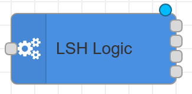
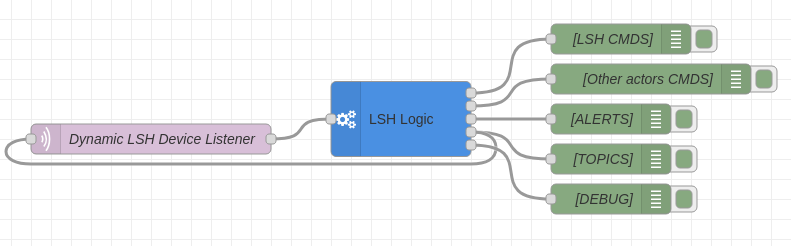

# Node-RED Contrib LSH Logic

[](https://badge.fury.io/js/node-red-contrib-lsh-logic)
[](https://github.com/labodj/node-red-contrib-lsh-logic/actions/workflows/ci.yml)
[](./LICENSE)

A single, powerful Node-RED node to manage advanced automation logic for an LSH (Labo Smart Home) style system. Built with TypeScript for maximum reliability.

This node replaces a complex flow of function nodes with a single, robust, and stateful component that manages device state, implements advanced click logic, and monitors device health.



---

## Key Features

- **Declarative System Configuration**: Define all your system's devices in a single, clear `system-config.json` file. The node automatically reloads it on changes.
- **Centralized State Management**: Maintains an in-memory registry of all device states, health, and configurations, which can be exported to the context for easy debugging and dashboarding.
- **Advanced Click Logic**: Implements "long-click" (smart toggle) and "super-long-click" (turn all off) actions across multiple devices.
- **Reliable Network Protocol**: Uses a two-phase commit protocol for network-based button clicks to ensure commands are not lost, even on unreliable networks.
- **Intelligent Watchdog**: Actively monitors device health with a multi-stage ping mechanism. It uses a smart initial verification process to quickly and accurately detect offline devices at startup, preventing false alarms.
- **Dynamic MQTT Topic Management**: Emits messages on a dedicated output to dynamically configure an `mqtt-in` node, automatically managing topic subscriptions and unsubscriptions as your configuration changes.

## Installation

You can install the node directly from the Node-RED **Palette Manager**.

Alternatively, run the following command in your Node-RED user directory (typically `~/.node-red`):

```bash
npm install node-red-contrib-lsh-logic
```

## How It Works

This node is designed to be the central brain of your LSH-style home automation system. It listens for all relevant MQTT messages from your devices, processes them according to your configuration, and sends back commands.

### Inputs

The node automatically determines which topics to listen to based on your `system-config.json`. You simply connect its "Configuration" output to an `mqtt-in` node to complete the setup. It primarily processes:

1. **LSH Protocol Topics**:
    - `<lshBasePath>/<device-name>/conf`: For receiving a device's static configuration (actuator IDs, button IDs).
    - `<lshBasePath>/<device-name>/state`: For receiving the current state of a device's actuators.
    - `<lshBasePath>/<device-name>/misc`: For miscellaneous events like network clicks, boot notifications, and ping responses.

2. **Homie Convention Topics**:
    - `<homieBasePath>/<device-name>/$state`: For monitoring the online/offline status of devices.

### Outputs

The node has five distinct outputs for clear and organized flows:

1. **LSH Commands**: Publishes messages to control your LSH devices (`c_aas`, `d_nca`, `c_f`, pings, etc.).
2. **Other Actor Commands**: Publishes generic commands for non-LSH devices (e.g., Tasmota, Zigbee2MQTT). The payload contains the target actor names and the desired state.
3. **Alerts**: Outputs formatted, human-readable alert messages (e.g., for Telegram) when a device's health status changes (goes offline or comes back online).
4. **Configuration**: Emits specially crafted messages to dynamically configure an `mqtt-in` node's subscriptions. This is the key to a fully automated setup.
5. **Debug**: Forwards the original, unprocessed input message for logging and debugging purposes.

## Configuration

### Node Settings

The node's behavior is customized through the editor panel:

- **MQTT Path Settings**: Define the base paths for your Homie and LSH topics.
- **System Config**: Path to your `system-config.json` file, relative to the Node-RED user directory.
- **Context Interaction**: Configure how the node's internal state is exposed to the flow/global context.
- **Timing Settings**: Fine-tune all system timeouts and intervals, including the `Initial Check Delay` for the smart startup detection.

### `system-config.json`

This is the core configuration file that defines all devices in your system and, optionally, their button actions. It should be placed in your Node-RED user directory (e.g., in a `configs/` subfolder).

```json
{
  "devices": [
    {
      "name": "living-room-switch",
      "longClickButtons": [
        {
          "id": "B1",
          "actors": [
            { "name": "living-room-light", "allActuators": true, "actuators": [] }
          ],
          "otherActors": ["tasmota_shelf_lamp"]
        }
      ]
    },
    {
      "name": "living-room-light"
    },
    {
      "name": "kitchen-light"
    }
  ]
}
```

- **`devices`**: An array of all devices in your system. Every device you want the node to manage **must** be listed here.
- **`name`**: The unique MQTT name of the device. This is the only required property for a device entry.
- **`longClickButtons` / `superLongClickButtons` (Optional)**: Arrays defining actions for different click types. If a device is only an actor (like a light) and doesn't send clicks, these properties can be omitted entirely.
- **`actors`**: A list of LSH devices to control.
- **`otherActors`**: A list of non-LSH device names to control.

## Best Practices

### Dynamic MQTT Subscriptions

The most powerful way to use this node is to let it manage your MQTT subscriptions automatically. This creates a "zero-maintenance" flow that adapts to your configuration.

**Connect the 4th output ("Configuration") directly to an `mqtt-in` node.**

 <!-- It's recommended to add a screenshot for this -->

When you deploy or when `system-config.json` changes, the `lsh-logic` node will:

1. Send a message to the `mqtt-in` node to **unsubscribe from all topics**.
2. Send a second message to **subscribe to the new, correct list of topics**.

This ensures your `mqtt-in` node is always listening to exactly the right topics without any manual changes.

### Configuration and State

- **File Location**: Keep your `system-config.json` in a sub-folder of your Node-RED user directory (e.g., `~/.node-red/configs/`) to ensure it's included in your backups.
- **Context for Debugging**: Use the "Context Interaction" settings to expose the internal state to a flow or global variable. This is invaluable for creating dashboards or debugging issues without needing to add `debug` nodes everywhere.

## Troubleshooting

- **Node Status: "Config Error"**: This status appears if the `system-config.json` file cannot be read or is invalid. Check the path in the node's settings and use a JSON linter to validate the file's syntax.
- **Device Unresponsive Alerts**: If you receive an alert, check the device's power and network connection. Ensure the `name` in `system-config.json` exactly matches the device name used in its MQTT topics.
- **Clicks Not Working**: If a long-click fails, a warning will appear in the Node-RED debug sidebar with the reason (e.g., "Target actor(s) are offline"). Check the actor's status in the exposed context.

## Contributing

Contributions are welcome! If you'd like to contribute, please feel free to open an issue to discuss a new feature or bug, or submit a pull request.

### Development Setup

To set up the development environment:

1. Clone the repository.
2. Run `npm install` to install all dependencies.
3. Run `npm run build` to build the project.
4. Run `npm test` to run the test suite.

## License

This project is licensed under the [Apache 2.0 License](./LICENSE).
